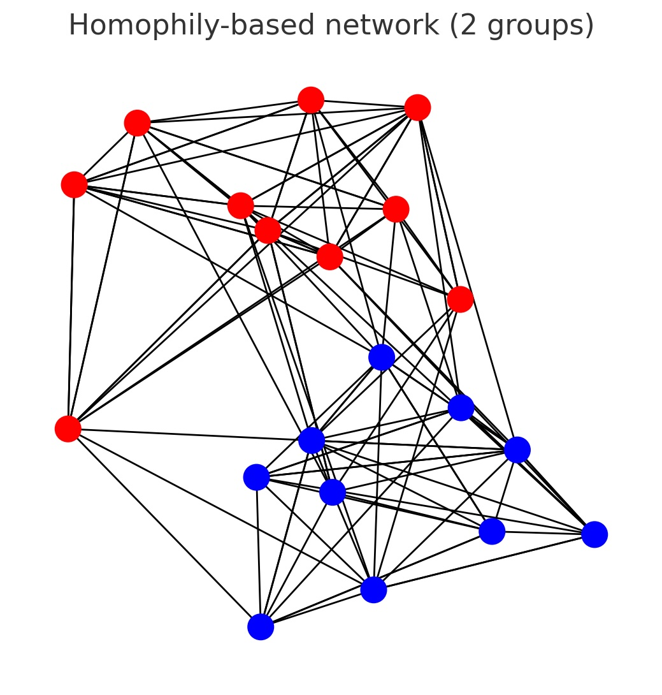

# Agent-Based Directed Network Generation with JSON Configuration

## Introduction

Agent-based modeling is used here to generate a directed network of 100 agents (nodes) by simulating how individual agents form links over time. We treat agents as nodes in a graph and allow them to create directed edges (links) according to specified rules . This JSON-configurable model lets you set the number of agents, the linking strategy (how connections are formed), the number of time steps to simulate, whether the network evolves dynamically or remains static, and whether to include edge weights. A static network means the structure is generated once and then remains fixed, whereas a dynamic network means the network changes over time (edges/nodes are added or reconfigured at each time step) . By adjusting these parameters, we can capture complex network behaviors through a bottom-up simulation of agent interactions.

There are three conceptually identical versions of this program included: 
1. network-agents.py - Regular python `python network-agents.py`
2. networks.py - Networks minus agent based model `python networks.py`
3. networks.go and visualize.go (Go Versions) `go run networks.go && go run visualize.go`
4. networks.ipynb - A Jupyter Notebook version of the python code `jupyter lab` then run the notebook

For python versions, create a virtual environment first: `python3 -m venv .venv` then `source .venv/bin/activate` then `pip install -r requirements.txt` 

Python versions evaluated/tested using Python 3.13.2 on OSX (Mac with Apple Silicon). 

## Linking Strategies

The program supports several network formation strategies that can be selected via the "linking_strategy" parameter in the JSON config. Each strategy models a different rule of how agents choose whom to connect to:
- Random linking (Erdős–Rényi model): Each possible directed edge between distinct agents is created with some independent probability p. This produces a random network without bias, often denoted G(n, p) in graph theory. For example, in an Erdős–Rényi graph, the model chooses each of the possible edges with probability p . A low p yields a sparse random network, while a higher p yields a dense network.
- Preferential attachment: New connections favor nodes that already have many connections – a “rich get richer” effect . The simulation can start with a small seed network and then add new agents one by one. Each new agent creates edges to existing agents with probability proportional to the existing agents’ current degree (popularity). This process yields a scale-free network with a few highly-connected hubs . In other words, nodes that already have high degree attract even more links, following the Barabási–Albert model of network growth.
- Homophily-based linking: Agents tend to form ties with others who are similar to themselves (sharing some attribute or group) – this is the principle of homophily (the propensity for similar agents to connect) . In the simulation, each agent is assigned to a group or has a trait; the probability of a link forming is higher if two agents share the same group than if they are from different groups. This often leads to networks with clustered communities of similar nodes, reflecting homophily in the network structure. For example, if agents are split into groups A and B, the model might use a higher intra-group connection probability p_in and a lower inter-group probability p_out to bias edge creation within groups.

  Figure: A sample directed network generated using the homophily strategy. This example has 20 agents divided into 2 groups (red and blue nodes). Edges predominantly connect nodes of the same color, forming two clusters – an illustration of homophily where similar nodes (same color) preferentially connect to each other. Such clustered connectivity emerges from the homophily rule in the simulation.


## Implementation and Simulation Design

The program is implemented in Python using NetworkX to manage the graph data structure (directed graph). It reads the configuration from a JSON file and then constructs the network according to the chosen parameters:
 - Initialization: First, a directed graph with the specified number of nodes (num_agents) is created. Each node represents an agent . If the strategy involves agent attributes (e.g. homophily), those attributes (like group membership) are assigned to nodes at this stage.
 - Dynamic vs. static evolution: If dynamic is true, the simulation will loop through the specified number of time_steps. At each time step, the network is updated according to the linking strategy:
 - For random linking, at each step each agent has a chance to create a new outgoing link to another agent (with probability p), modeling random interactions accumulating over time.
 - For preferential attachment, new nodes may be introduced over time (growing the network). For example, starting from a small initial network, at each time step a new agent node is added with a few edges that attach preferentially to high-degree nodes (this implements the Barabási–Albert growth mechanism) .
 - For homophily, at each step agents attempt connections biased by their group similarity – e.g. an agent might randomly pick another agent and form a link with probability p_in if they share the same group (or p_out if not). Over multiple time steps, this yields clusters of same-group agents connected together.

The program prints log messages each step summarizing the actions (e.g. how many edges were added or which node was added). If dynamic is false (static network), the graph is generated in one go without iterative steps (e.g. creating all random edges at once, or using a network generation algorithm directly for preferential attachment).
 - Edge weights: If edge_weights is enabled, the simulation will assign a weight attribute to each edge. By default in this implementation, weights are handled in a simple way: for static generation, a random weight (e.g. a random float between 0 and 1) is assigned to each edge; for dynamic generation, repeated interactions can accumulate – if the same edge gets formed again in a later step, the code will increment that edge’s weight (so the weight may represent the number of times that connection was formed). This feature can be customized further, but as an example it captures the intensity or frequency of interactions on an edge.
 - Output generation: After the simulation loop (or after initial generation for static), the final directed graph is saved to the specified output format. We utilize NetworkX’s I/O capabilities to write the graph to standard formats like GraphML or GEXF. For instance, if the config specifies "output_format": "GraphML", the program will call nx.write_graphml(G, "network.graphml") to save the graph. GraphML is an XML-based format that supports directed graphs and can include node/edge attributes (such as weights) , making it suitable for preserving all information. If instead a visual output (PNG image) is requested, the program uses Matplotlib with NetworkX to draw the graph and save it as an image. The console log will indicate where the network file is saved (e.g., “Network saved to network.graphml”).

The [Python code](network-agents.py) puts all these pieces together. The code is structured into functions for each strategy and reads the JSON configuration to decide which strategy to run. 

#### The JSON file is structured like this: 

```json
{
  "num_agents": 100,
  "linking_strategy": "preferential_attachment",
  "time_steps": 100,
  "dynamic": true,
  "edge_weights": false,
  "edges_per_step": 1,
  "output_format": "GraphML"
}
```

**How it works:** The code above reads in the JSON config, calls one of the generate_*_graph functions based on the chosen strategy, and then saves the resulting NetworkX directed graph to a file. During a dynamic simulation, it prints a log for each time step (as shown in the examples below). In a static generation, it prints a summary after creating the edges. Finally, it reports the number of nodes and edges in the generated network and confirms saving the file.


In general, the JSON config includes the following keys:
- num_agents (int): Number of agent nodes in the network (e.g. 100).
- linking_strategy (string): Strategy for link formation – "random", "preferential_attachment", or "homophily" (as described above).
- time_steps (int): Number of time steps to simulate (if dynamic is true). If dynamic is false, this can be 1 (or omitted) since the network is generated in one go.
- dynamic (bool): true to simulate the network evolution over multiple time steps; false to generate a static network.
- edge_weights (bool): true if edges should have weight attributes (the program will assign or accumulate weights as it runs); false for unweighted edges.
- Strategy-specific parameters (optional): Depending on the chosen strategy, additional fields can be provided:
- If "linking_strategy": "random" – you can specify p (float between 0 and 1) as the probability for any given directed edge to exist. For dynamic simulations, this probability is applied at each time step per agent.
- If "linking_strategy": "preferential_attachment" – you can specify edges_per_step (int, often denoted m) which is the number of edges each new node will create when it joins. A higher edges_per_step means new nodes try to attach to more existing nodes.
- If "linking_strategy": "homophily" – you may specify homophily_groups (int) to set how many groups or categories agents are divided into, p_in (float) as the probability of a link between same-group agents, and p_out (float) as the probability of a link between different-group agents. Typically, you choose p_in > p_out to enforce homophily (more likely connections within groups).

You can create a JSON file (e.g., config.json) with the desired parameters as above.

### Usage Instructions
1.	Prepare the configuration: Save your JSON configuration to a file (for example, config.json). Adjust the parameters and strategy as needed for your scenario (see the sample and parameter descriptions above).
2.	Run the Python program: Execute the script with the JSON file path as an argument. For example, if the code is saved as generate_network.py, run:

```bash
python generate_network.py config.json
```
This will start the simulation. The program will read the config and then output log messages to the console showing the progress (especially if the network is dynamic with multiple steps).

	3.	Check the output: After completion, the final network will be saved in the specified format. For instance, with "output_format": "GraphML", you will get a file network.graphml in the working directory. This file can be opened with graph analysis tools (like Gephi or NetworkX itself) to inspect the network structure. If you specified "PNG", the script will produce an image file (e.g., network.png) visualizing the network. The console output will confirm the file name and location.

Below is an example of console output from running the program with a small random-dynamic configuration (for demonstration purposes):
```bash
Step 1: added 5 random edges  
Step 2: added 3 random edges  
Network saved to network.graphml  
Final network has 10 nodes and 8 edges.  
```
Each “Step X” line reports how many new edges were added in that time step. In the end, the program confirms saving the network and reports the total nodes and edges. In a preferential attachment run, you would see messages for each new node added, and in a homophily run you would see edges added per step with that strategy. This gives you a summary of the process, helping to verify that the simulation behaved as expected.

Note: The GraphML or GEXF outputs will contain all the nodes and edges (and weights if enabled). You can import these files into visualization or analysis software to further explore the network structure. The PNG output (if chosen) provides a quick visualization, though for large networks the graph drawing can be quite dense. Overall, this agent-based network generator allows flexible experimentation with different network formation mechanisms, controlled entirely by the JSON config parameters and the simulation code.

## References

- **Agent-Based Modeling.**  
  [Wikipedia](https://en.wikipedia.org/wiki/Agent-based_model). This article describes agent-based models, their principles, and applications.

- **Erdős–Rényi Model.**  
  [Wikipedia](https://en.wikipedia.org/wiki/Erd%C5%91s%E2%80%93R%C3%A9nyi_model). An overview of the random graph generation model where edges are created independently with a fixed probability.

- **Barabási–Albert Model (Preferential Attachment).**  
  [Wikipedia](https://en.wikipedia.org/wiki/Barab%C3%A1si%E2%80%93Albert_model). A description of the scale-free network model based on preferential attachment.

- **Homophily.**  
  [Wikipedia](https://en.wikipedia.org/wiki/Homophily). An article discussing the tendency of individuals to associate and bond with similar others.

- **NetworkX Documentation.**  
  [NetworkX](https://networkx.org/documentation/stable/). The official documentation for NetworkX, a Python library for creating, manipulating, and studying the structure, dynamics, and functions of complex networks.

- **Graphviz.**  
  [Graphviz](https://graphviz.org/). Information and resources for Graphviz, an open-source graph visualization software.

- **GraphML.**  
  [GraphML - Wikipedia](https://en.wikipedia.org/wiki/GraphML). An XML-based file format for graphs, capable of storing network structure along with additional data attributes.